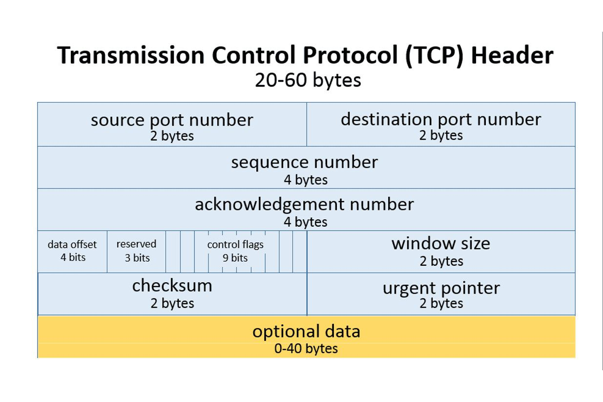
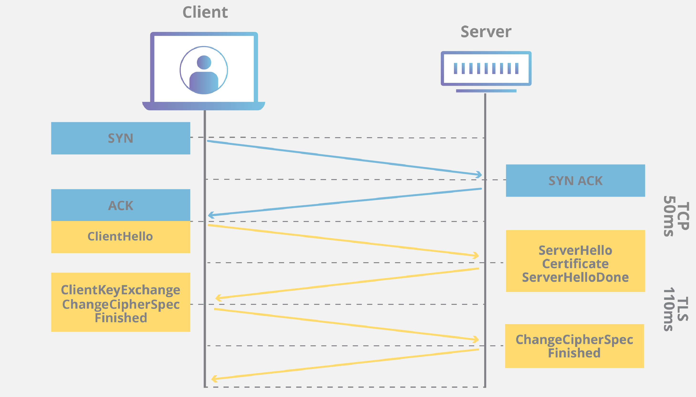
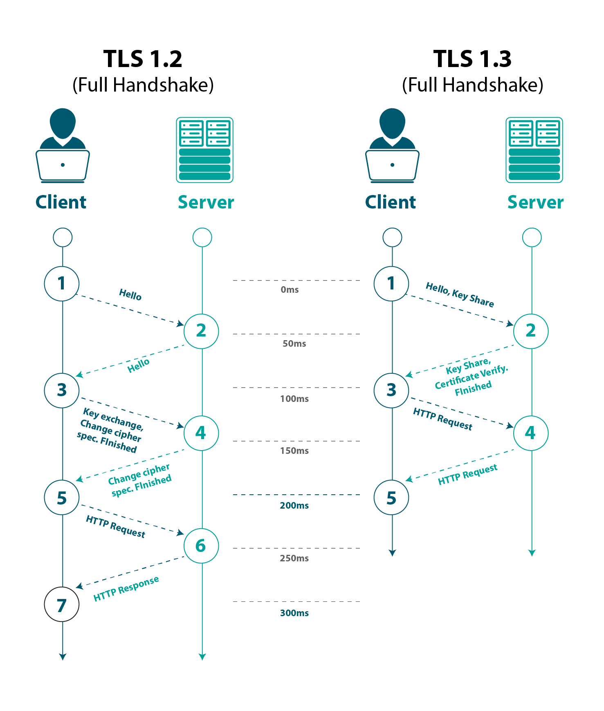

# TCP_sockets_simple_server

1. TCP (Transmission Control Protocol) is one of the main protocols of the Internet protocol suite. 
It originated in the initial network implementation in which it complemented the Internet Protocol. 
It's part of 4th layer according to OSI model and 3rd in TCP/IP model - Transport layer.
Therefore, the entire suite is commonly referred to as TCP/IP.
It is used to establish and maintain reliable, ordered, and error-checked connections between applications running 
on different devices over a networks.

2. This protocol not only provides reliable delivery, but also controls data flow to prevent network congestion 
and guarantees that data is received in the order in which it was sent, unlike UDP.
It divides the data stream into smaller portions and adds a TCP header (each segment has its own) that contains 
information about the sequence, acknowledgment number, segment size, and other control information.
Build of TCP header:  
  
Each segment is then transmitted through the network from endpoint to endpoint, and the receiving host acknowledges 
each received segment. In case a segment is lost, the host sends a request for retransmission of the lost segment 
(multiplexing). TCP uses a connection-oriented connection between two endpoints, and each connection is 
identified by its unique IP addresses and port numbers.

3. Before TCP sends data to the client, a connection must be established between them, called a "three-way handshake". 
The client, sends a segment containing the SYN flag (synchronizing sequence numbers - flag). 
The segment contains a random sequence number (ISN number) used to 
later merge data fragments. The server receiving this segment, is informed that the client wants to establish 
a connection. In response, the server sends a segment with the 
SYN and ACK flags set (the ACK flag informs sender that server received the 1st segment), 
a sequence number received from the client increased by 1, and its own random sequence number.
Next client sends a segment back to server with the ACK flag set to confirm the receipt of the previous 
message with the server's sequence number increased by 1. This ends the process of establishing connection.
Now data flow can be properly executed.
Process of three-way handshake:  
  

4. After sending desired info, session must be closed between hosts. So client sends a segment 
with the FIN flag to server. That is the way to indicate that the client want to close the session. 
The server responds with a segment confirming receipt with the ACK flag. 
Then, server sends a segment with the FIN flag, and client responds with a confirming segment with the ACK flag. 
This closes the TCP session/connection between hosts.  

**Details how code works is described using comments in "server.go" and "client.go".**

How to run:
```
cd main
# 1st 
go run server.go
# 2nd
go run client.go
```
5. Authorization:  
Authorization is a process by which a server determines if the client has permission to use a resource or access a file.
In this case, as well as in the majority of cases authorization is usually coupled with authentication so that the server
has some concept of who the client is that is requesting access.  
In my case client provides only access credentials which allow user to enter the chat. Simple as that. Credentials should be
stored on server side. User provides credentials and they are being matched with substitutes from secured resources. Which
is part of one-factor authentication.

6. SSL/TLS:
OpenSSL (https://www.openssl.org/) is an open-source library that provides tools and functions for implementing cryptographic protocols such as 
Secure Sockets Layer (SSL) and Transport Layer Security (TLS).
It also offers tools for key generation, certificate generation, and performing various operations related to them.  
Download for Windows: https://slproweb.com/products/Win32OpenSSL.html  
Procedure of using OpenSSL to generate key and certificate as part of TLS:  
Generating private key:  
```
openssl genpkey -algorithm RSA -out private-key.key
```
Generating certificate:  
```
openssl req -new -key private-key.key -out certificate.csr
```
Sign up certificate:  
```
openssl x509 -req -in certificate.csr -signkey private-key.key -out certificate.pem
```

For a testing or development environment, it is possible to self-sign a certificate. However, for a production environment, 
it is recommended to use trusted authorities and organizations (**Certificate Authorities - CA**). 
A good choice is to use the services of 'Let's Encrypt' (https://letsencrypt.org/), which is completely free.  


TLS  is a cryptographic protocol that operates at the transport layer of the TCP/IP protocol suite. It employs encryption, authentication, and data integrity to protect information transmitted over the Internet. 
It is the successor to the Secure Sockets Layer (SSL) protocol and is widely used in secure connections such as HTTPS, 
IMAP, and SMTP. Description of operation of TLS:  
After the TCP handshake is completed, the TLS handshake initiation takes place. This process is responsible for establishing
a secure connection between the client and the server. Here are the general steps of the TLS handshake:
- Sending TLS request: The client initiates the TLS handshake by sending a TLS request to the server.
- TLS response: The server receives the TLS request and responds to the client with its certificate (containing the public key) and selected cryptographic parameters.
- Certificate verification: The client verifies the server's certificate, ensuring that it is valid and properly signed by a trusted certificate authority.
- Session key generation: The client generates a random session key that will be used for encrypting and decrypting data during this connection.
- Encryption and key exchange: The client encrypts the session key using the server's public key and sends it back to the server.
- Session key reception and decryption: The server receives the encrypted session key from the client and decrypts it using its private key.
- Ready confirmation: The client and server confirm that the TLS handshake has been successfully completed and they are ready for secure communication.
Below presentation of diagram of above process:  


The diagram above applies to 1.2 version of TLS. But there is also 1.3 version more common in usage. On the other hand
1.2 describes very well basic concept of TLS protocol. Version 1.3 improves whole process, as the graph below shows:  



Golang project instead of Java. 
Easier and more efficient way to implement tcp sockets server. 
Go routines and concurrency which are more suitable than Runnable interface from Java.
Go routines are based on Fork-Join Model.


Resources and bibliography:  
https://go.dev/tour/concurrency/5  
https://ai.ia.agh.edu.pl/pl:dydaktyka:unix:lab_prog_siec  
https://pasja-informatyki.pl/sieci-komputerowe/uzgadnianie-trojetapowe/  
https://home.agh.edu.pl/~balis/dydakt/sr/lab/gniazda2009.pdf  
https://pkg.go.dev/net  
https://go.dev/tour/concurrency/1  
https://go.dev/tour/concurrency/2  
https://go.dev/tour/concurrency/3  
https://www.youtube.com/watch?v=qyM8Pi1KiiM  
https://golangr.com/socket-server/  
https://www.developer.com/languages/intro-socket-programming-go/  
https://linuxhint.com/golang-tcp-server/  
https://go.dev/tour/concurrency/5  
https://www.youtube.com/watch?v=1BfCnjr_Vjg
https://www.ibm.com/docs/de/zos/2.4.0?topic=protocols-tls-ssl
https://www.ibm.com/docs/en/zos-connect/zosconnect/3.0?topic=connect-transport-layer-security-tls
https://www.ibm.com/support/pages/configuring-your-ibm-i-system-secure-sockets-layer-ssltransport-layer-security-tls-protocols-and-cipher-suites
https://pkg.go.dev/crypto/tls
https://gist.github.com/denji/12b3a568f092ab951456