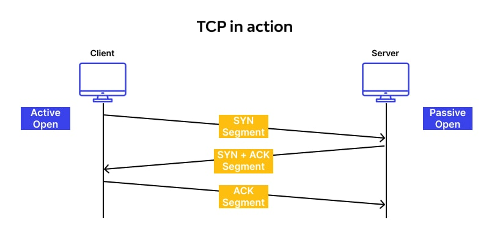

# TCP_sockets_simple_server

1. TCP (Transmission Control Protocol) is one of the main protocols of the Internet protocol suite. 
It originated in the initial network implementation in which it complemented the Internet Protocol. 
It's part of 4th layer according to OSI model and 3rd in TCP/IP model - Transport layer.
Therefore, the entire suite is commonly referred to as TCP/IP.
It is used to establish and maintain reliable, ordered, and error-checked connections between applications running 
on different devices over a networks.

2. This protocol not only provides reliable delivery, but also controls data flow to prevent network congestion 
and guarantees that data is received in the order in which it was sent, unlike UDP.
It divides the data stream into smaller portions and adds a TCP header (each segment has its own) that contains 
information about the sequence, acknowledgment number, segment size, and other control information.
Build of TCP header:  
  
Each segment is then transmitted through the network from endpoint to endpoint, and the receiving host acknowledges 
each received segment. In case a segment is lost, the host sends a request for retransmission of the lost segment 
(multiplexing). TCP uses a connection-oriented connection between two endpoints, and each connection is 
identified by its unique IP addresses and port numbers.

3. Before TCP sends data to the client, a connection must be established between them, called a "three-way handshake". 
The client, sends a segment containing the SYN flag (synchronizing sequence numbers - flag). 
The segment contains a random sequence number (ISN number) used to 
later merge data fragments. The server receiving this segment, is informed that the client wants to establish 
a connection. In response, the server sends a segment with the 
SYN and ACK flags set (the ACK flag informs sender that server received the 1st segment), 
a sequence number received from the client increased by 1, and its own random sequence number.
Next client sends a segment back to server with the ACK flag set to confirm the receipt of the previous 
message with the server's sequence number increased by 1. This ends the process of establishing connection.
Now data flow can be properly executed.
Process of three-way handshake:  
  

4. After sending desired info, session must be closed between hosts. So client sends a segment 
with the FIN flag to server. That is the way to indicate that the client want to close the session. 
The server responds with a segment confirming receipt with the ACK flag. 
Then, server sends a segment with the FIN flag, and client responds with a confirming segment with the ACK flag. 
This closes the TCP session/connection between hosts.  

**Details how code works is described using comments in "server.go" and "client.go"**

How to run:
```
cd main
# 1st 
go run server.go
# 2nd
go run client.go
```


Golang project instead of Java. 
Easier and more efficient way to implement tcp sockets server. 
Go routines and concurrency which are more suitable than Runnable interface from Java.
Go routines are based on Fork-Join Model.


Resources and bibliography:  
https://go.dev/tour/concurrency/5  
https://ai.ia.agh.edu.pl/pl:dydaktyka:unix:lab_prog_siec  
https://pasja-informatyki.pl/sieci-komputerowe/uzgadnianie-trojetapowe/  
https://home.agh.edu.pl/~balis/dydakt/sr/lab/gniazda2009.pdf  
https://pkg.go.dev/net  
https://go.dev/tour/concurrency/1  
https://go.dev/tour/concurrency/2  
https://go.dev/tour/concurrency/3  
https://www.youtube.com/watch?v=qyM8Pi1KiiM  
https://golangr.com/socket-server/  
https://www.developer.com/languages/intro-socket-programming-go/  
https://linuxhint.com/golang-tcp-server/  
https://go.dev/tour/concurrency/5  
https://www.youtube.com/watch?v=1BfCnjr_Vjg